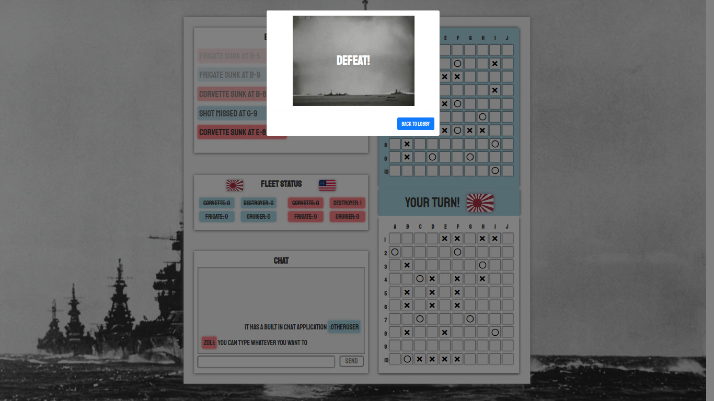

Multiplayer BattleShip game made with React JS.

At first you have to give your name and after that you get placed in a lobby. If another user joins you can challenge the to a game, if they accept then the screen switches to the game screen. The game auto generates you a board of ships.

You have your board at the top and when it's you turn then you can make a guess. If it's a correct guess then an 'X' shows up if not a 'O'. After that it's the other players turn to make a guess. 

On the top left side, the game board features a log screen where you can see what exactly happened. If you hit a ship it also tells you how many times you have to hit it again to sink it. 

In the middle you see a status window about the two players fleet, which if a ship sunk updates appropriately. 

Under the fleet status window you can see a chat window. You can type anything you want to and the other player can see it. It works by typing something in the input field and pressing send or by hitting enter.

Once one of the players fleet is destroyed a modal pops up showing the result screen. After closing the modal you get placed back in to the lobby.

